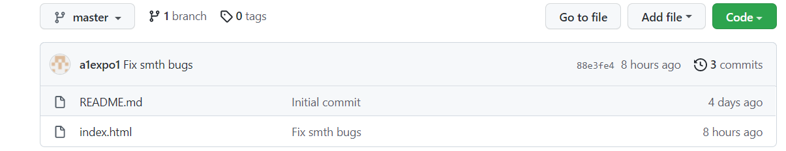
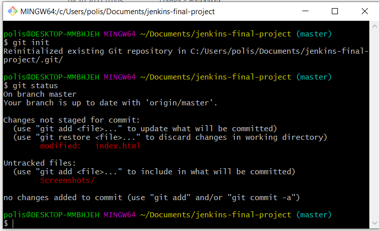
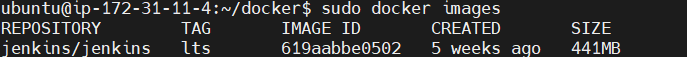
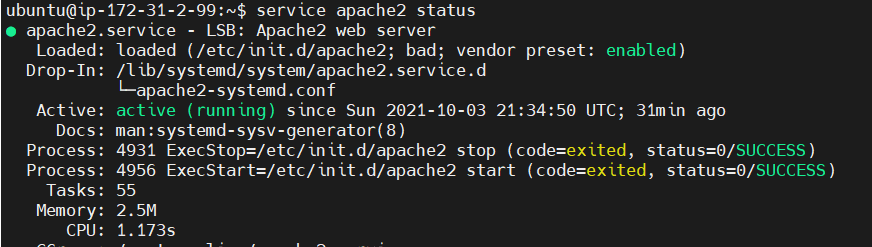
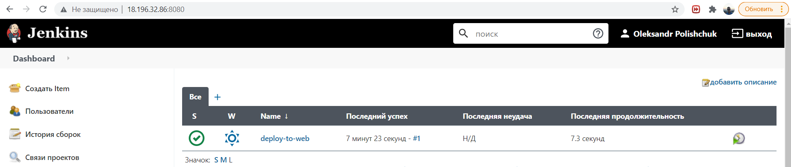
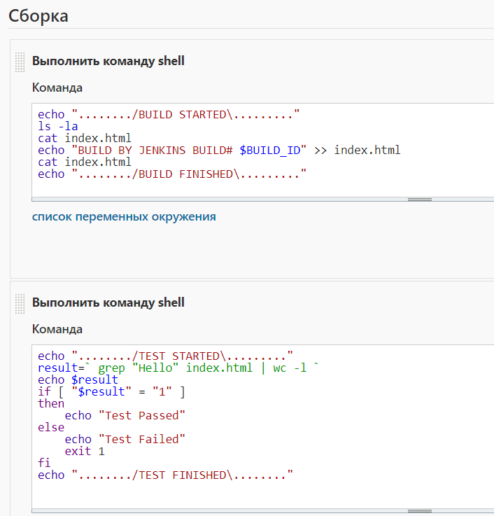
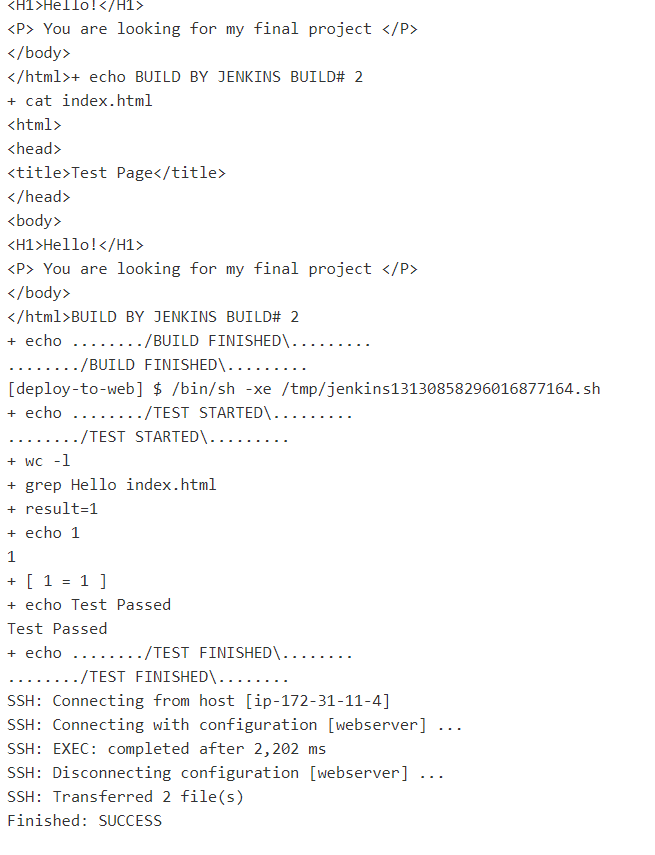
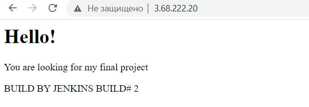

# README FOR PROJECT REPORT #
The project was based on the index.html page, which should get to the web server if it is successfully tested.

The project is based on three hosts:
Windows with Git client;

Ubuntu Server 20.04 with docker installed, on which Jenkins is running;

Ubuntu Server 20.04 with Apache web server.

The essence of the job is that it extracts all the files from GitHub, shows what the files are, opens the contents of the index.html file and adds a signature to it as a collection number. Next, it checks the index.html file for the word "Hello". If it is, the test is passed. Eventually, the job connects via SSH to the Web Server.

